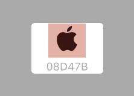

# MiddleAlignedButton

[](https://travis-ci.org/hcbarry/MiddleAlignedButton)
[](http://cocoapods.org/pods/UIButton+MiddleAligning)
[](http://cocoapods.org/pods/UIButton+MiddleAligning)
[](http://cocoapods.org/pods/UIButton+MiddleAligning)



## Usage

To run the example project, clone the repo, and run `pod install` from the [Example](Example) directory first.

#### Objective-C Example
```objective-c
  UIButton *button = [UIButton buttonWithType:UIButtonTypeCustom];
  UIImage  *image = [UIImage imageNamed:@"YOUR_IMAGE_NAME"];
  NSString *title = @"YOUR_TITLE";
  CGFloat  spacing = 2.0f;

  [button setImage:image forState:UIControlStateNormal];
  [button setTitle:title forState:UIControlStateNormal];
  [button middleAlignButtonWithSpacing:spacing];
```

#### Swift Example
```swift
  let button = UIButton(type:.Custom)
  let image = UIImage(named: "YOUR_IMAGE_NAME")
  let title = "YOUR_TITLE"
  let spacing : CGFloat = 2.0

  button.setImage(image, forState: .Normal)
  button.setTitle(title, forState: .Normal)
  button.middleAlignButtonWithSpacing(spacing)
```

## Requirements

* Xcode Minimum Supported Version: **Xcode 5.0**
* iOS Minimum Deployment Target: **iOS 6.0**
* Language Support: **Swift** *(any version)*, **Objective-C**

## Installation

#### Using [CocoaPods](http://cocoapods.org)
1. Add the pod `UIButton+MiddleAligning` to your [Podfile](http://guides.cocoapods.org/using/the-podfile.html).

  ```bash
  pod "UIButton+MiddleAligning"
  ```
1. Run `pod install` from Terminal, then open your app's `.xcworkspace` file to launch Xcode.
1. Import the `UIButton+MiddleAligning` header.
  * Swift project: `import UIButton+MiddleAligning`
  * Objective-C project: `import "UIButton+MiddleAligning.h"`

#### Manually from [GitHub](https://github.com)
1. Download the source files in the [Pod/Classes/UIButton+MiddleAligning](Pod/Classes/UIButton+MiddleAligning) subdirectory.
1. Add the source files to your Xcode project.
1. Import the `UIButton+MiddleAligning` header.
  * Swift project: `import UIButton+MiddleAligning`
  * Objective-C project: `import "UIButton+MiddleAligning.h"`

## Author

Barry Lee, hcbarry@gmail.com

## License

MiddleAlignedButton is available under the MIT license. See the LICENSE file for more info.
